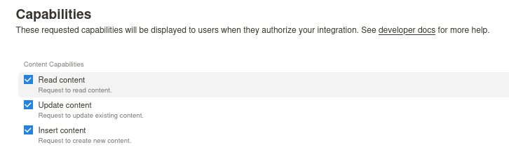
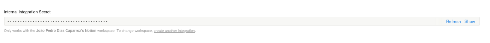
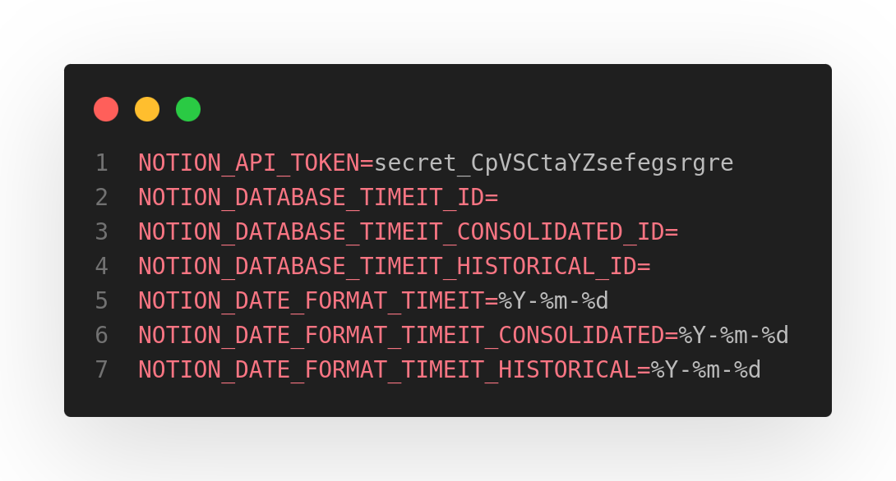
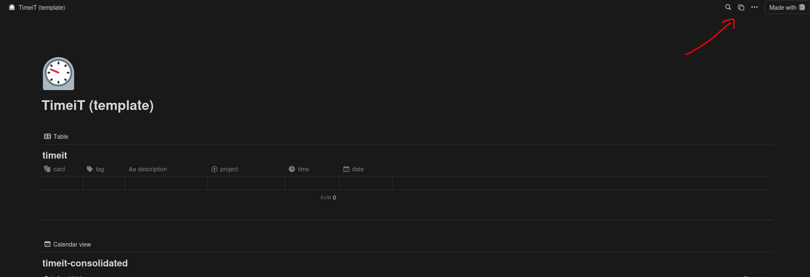
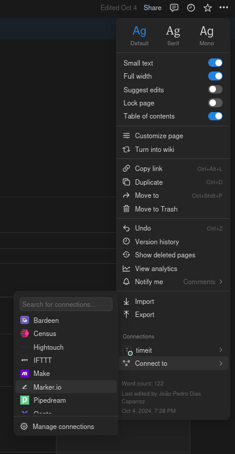
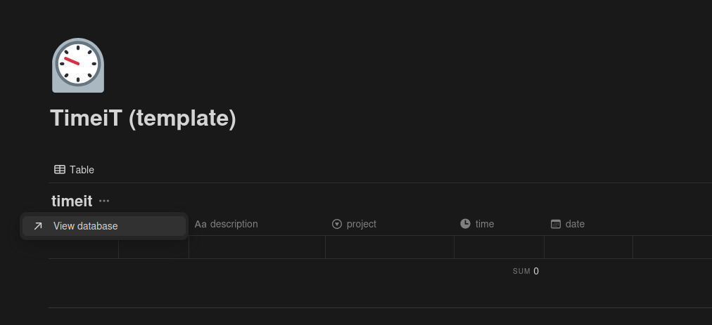

# How to Use

If you want to use **TimeiT**, you'll need to follow a few steps. Below, I explain how to do it:

 

# 1. Creating a Notion Integration

You need to create a new `integration` by following this link: [Notion Integration](https://www.notion.so/profile/integrations).

## Capabilities

The integration needs the following 3 `content` capabilities:

- Read content
- Update content
- Insert content

## Token

You’ll need the integration token for your `.env` file.

Copy it and place it in your `.env` file.

 

# 2. Duplicate the TimeiT Template

You need to duplicate the TimeiT template from my Notion template using this link: [Notion TimeiT Template](https://joaocaparroz.notion.site/Timeit-107c7e9cee0e80f39c5afbf540906910).

*You need to be logged in to duplicate.*

 

# 3. Give Access to the Integration

You need to grant access for your integration to your TimeiT page.

1. Go to `...` in the top right corner.
2. Go to `Connections`.
3. Click on `Connect to`.
4. Search for your integration name.
5. Done! =)

 

# 4. Getting All Database IDs

You need to retrieve the IDs of all 3 databases from the Notion page.

1. Go to any `database`.
2. Click `...` on the database title.
3. Click on `View database`.
4. Now you need to `copy` the database ID from your browser's URL.
   
5. Then, place the database ID in your `.env` file.
6. Repeat this for all 3 databases:
    - timeit
    - timeit-consolidated
    - timeit-historical
7. Done! =)

---

# Results

Your `.env` file will look like this:

