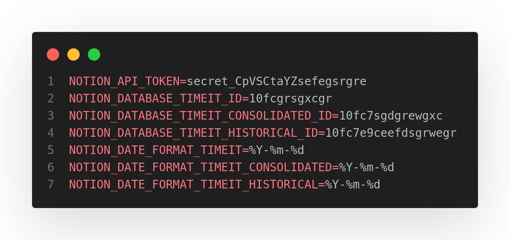
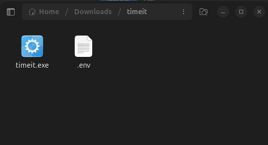

# Run!

To run .exe file, you need the .env fully completed like below:

- Next, get the last [releases](https://github.com/jpcaparroz/timeit/releases) on page!

- Download `timeit.exe` file

- Your folder structure need to be like these:
    

- Next, click on `.exe` file and follow the steps... (=