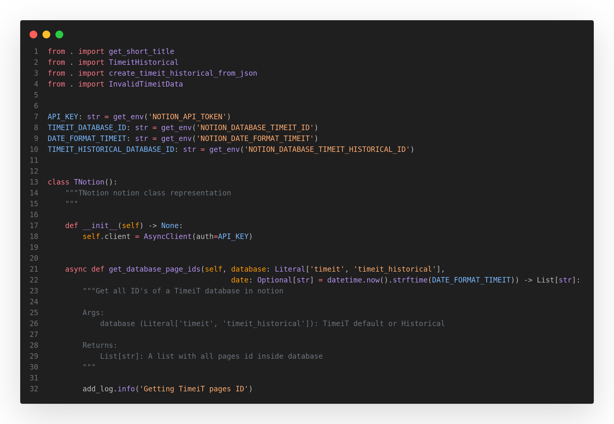
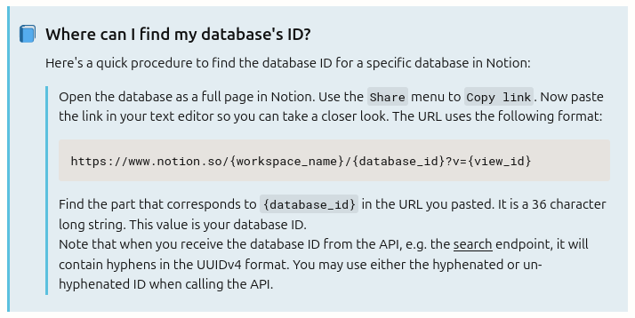

# TimeiT
A project that I use to map my work hours =)

---

## </> Code
Code example:

 

## 📋 Template
Get your notion template following the below link:

[Notion TimeiT Template for v1.0.0 ~ v1.1.0 release](https://joaocaparroz.notion.site/Timeit-107c7e9cee0e80f39c5afbf540906910)
[Notion TimeiT Template for v1.2.0 release](https://joaocaparroz.notion.site/TimeiT-template-v1-2-0-125c7e9cee0e800db8cfc0617072d596)

 

## 🔩 Requirements

- Python

  

## 🟢 Initiate
To start using or developing, install the necessary libraries using the commands:

* Create venv
  #####
      python -m venv .venv

* Install libs
  #####
      pip install -r .\requirements.txt

* Initialize venv
  #####
      .\.venv\Scripts\activate
      or
      source .venv/bin/activate

  

## ♨️ Notion Infos

To get notion database id, follow below image:

  

## ⚙️ Env Parameters

To initiate, the archive `.env` must be fill, like below:

[.env](/.env)
#####
    NOTION_API_TOKEN= secret_CpVDPSMKKioeioiojmz                                   # [string] Notion Service User API Token
    NOTION_DATABASE_TIMEIT_ID= 07c7e9ce34r5fsdf443                                 # [string] Notion timeit Database ID
    NOTION_DATABASE_TIMEIT_CONSOLIDATED_ID= 07c7e9cdzcxfr345dde7c188fa9c3          # [string] Notion timeit-consolidated Database ID
    NOTION_DATABASE_TIMEIT_HISTORICAL_ID= 07c7e9cdzcxfr345dde7c188fa9c3            # [string] Notion timeit-historical Database ID
    NOTION_DATE_FORMAT_TIMEIT= %Y-%m-%d                                            # [string] Python datetime format https://docs.python.org/pt-br/3.10/library/datetime.html#strftime-and-strptime-format-codes
    NOTION_DATE_FORMAT_TIMEIT_CONSOLIDATED= %Y-%m-%d                               # [string] Python datetime format https://docs.python.org/pt-br/3.10/library/datetime.html#strftime-and-strptime-format-codes
    NOTION_DATE_FORMAT_TIMEIT_HISTORICAL= %Y-%m-%d                                 # [string] Python datetime format https://docs.python.org/pt-br/3.10/library/datetime.html#strftime-and-strptime-format-codes

Copy below to make your .env file =)
#####
    NOTION_API_TOKEN= 
    NOTION_DATABASE_TIMEIT_ID=
    NOTION_DATABASE_TIMEIT_CONSOLIDATED_ID=
    NOTION_DATABASE_TIMEIT_HISTORICAL_ID=
    NOTION_DATE_FORMAT_TIMEIT=%Y-%m-%d
    NOTION_DATE_FORMAT_TIMEIT_CONSOLIDATED=%Y-%m-%d
    NOTION_DATE_FORMAT_TIMEIT_HISTORICAL=%Y-%m-%d

  

## ⚠️ Important

- Make sure all dependencies are installed correctly.

  

## 🤝 Colaborators

<table>
  <tr>
    <td align="center">
      <a href="https://www.linkedin.com/in/jo%C3%A3o-pedro-dias-caparroz-2b19a1161/" title="Linkedin Profile Icon">
         
        
          <b>João Pedro Dias Caparroz</b>
        
      </a>
    </td>
  </tr>
</table>

 

## 😄 Contribute

To contribute [click here](/docs/CONTRIBUTING.md) | *not ready*